# Documentation of approach and results
# Table of Contents
- [Approach](#approach)
- [Flows](#flows)
- [Qualitative performance](#qualitative-performance)
- [Quantitative performance](#quantitative-performance)
- [Iteration on the bot](#how-to-iterate-on-the-bot-for-better-quality-responses)
- [Conclusion and future work](#conclusion-and-future-work)

## Approach
### 1. Define the Policies for cancellation.
Following policies have been defined [here](../Policies.txt):
```
- Pre-Shipment Cancellation: Cancellation is only allowed if the order status is "Pending."
- Time-Based Cancellation Window: If an order was placed less than 10 days ago, it is eligible for cancellation. Otherwise, cancellation is not permitted.
- No Cancellation for Certain Items that are perishable or digital. eg:  food, flowers, digital downloads. 
```
#### Order database creation
Simulated via a simple excel sheet for the demo, can be found [here](../components/resources/order_db.xlsx).\
It is a single table containing all of user's order status entries with Schema:
```
- order_id: unique 5 digit numeric identifier 
- product_name: name of the product, str
- quantity: number of items ordered, int
- total_price: total price of the order, float
- order_status: status of the order, str with values "Pending", "Shipped", "Delivered", "Cancelled"
- order_date: date of the order, datetime
- updated_at: last updated date of the order, datetime
- item_type: type of the item, str with values "Perishable", "Digital"
```
#### How does bot apply the policies? 
- Via simple filters- Applying the filters using pandas.
- eg: If user wants to cancel an order, the bot will check if the order status is "Pending" and the order was placed less than 10 days ago. If both conditions are met, the bot will allow the cancellation.
Other conditions are checked similarly [here](../components/cancel_order.py). 

### 2. Define allowed actions by the bot.
Following actions are allowed:
```
track_order: Intercepts a command to track an order.
cancel_order: Intercepts a command to cancel an order.
end_conversation: Intercepts a command to end the conversation.
Other: All other commands.
```
Secondary action triggered by `track_order` and `cancel_order` actions:
```
order_extraction: Extracts the order_id from the user's message.
```

The flow between these actions is explained [here](#flows).

### 3. Create synthetic conversations between user and bot from the policies and allowed actions using LLMs
The synthetic conversations are created using [this](../components/resources/example_conversations_prompt.txt) prompt. 
This prompt was thrown to chatgpt as well as deepseek and a total of 13 conversations were generated (7 for order cancellation and 6 for order tracking).
Conversations can be found [here](../data/gold_dataset).

### 4. Manually label the ground truth next action for each turn in every synthetic conversation.
- Split each conversation into turns and manually label the ground truth next action for each turn. The data can be found [here](../data/intents_accuracy_data/ground_truth_intent_dialogues.xlsx).
- The splitting logic can be found [here](../scripts/intent_dialogues_test_data.py).

### 5. Use manually labelled next action data to tune next action classification prompt
- Write a prompt for next action classification and measure the accuracy for each predicted next action against the ground truth action using the labels in the last step.
- The prompt for next action classification can be found [here](../components/resources/next_step_prompt.txt).
- Iterate on the next action classification prompt till a high accuracy is achieved on the next action gold dataset.
Once a prompt is written for a next action classification, it's accuracy is measured against the ground truth labels. 
If the accuracy is low, the prompt is iterated upon till a high accuracy is achieved.
After iterating on prompts for all actions, the **final accuracy achieved on next action gold dataset was 97%**.
- All the prompts can be found [here](../components/resources).
- The final predictions can be found [here](../data/intents_accuracy_data/predicted_intents.xlsx).
- To measure accuracy, this [script](../scripts/intent_performance.py) was used.

## Flows
Here are the flows for the bot:

1. For every conversation turn, entire context of the conversation upto that point is taken into account.
2. At each turn, the next action is predicted based on the context, which could be one of the allowed actions:
```
track_order: Intercepts a command to track an order.
cancel_order: Intercepts a command to cancel an order.
end_conversation: Intercepts a command to end the conversation.
Other: All other commands.
```
3. Both `track_order` and `cancel_order` actions lead to an LLM call for extracting the order_id. (`order_extraction`)
4. If the order number is provided by the user, then the bot asks for it again and again till the user supplies one.
5. After user supplies the order number, the bot checks the order status and provides the status to the user if the lsat action was `track_order`.
6. Alternatively, if the last action was `cancel_order`, the bot checks the order status and applies the policies to check if the order can be cancelled.
7. At any point, if the user tries to stray away from the conversation, the `Other` intent is triggered and the bot tries to get the user to either track or cancel the order.
8. When it seems like user is done with the conversation, `end_conversation` action is triggered.


### Track Order flow

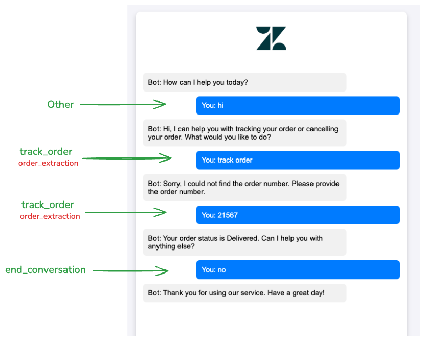
Explanation:
1. Other- Triggered by user saying 'hi'
2. track_order- Triggered by user saying 'track order'. This also leads to an LLM call for extracting the order_id. (order_extraction)
3. track_order- Triggered by user saying '21567'. This also leads to an LLM call for extracting the order_id. (order_extraction)
4. end_conversation- Triggered by user saying 'no'

### Cancel Order flow

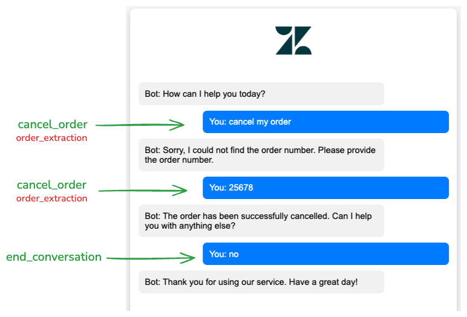
Explanation:
1. cancel_order- Triggered by user saying 'cancel my order'. This also leads to an LLM call for extracting the order_id. (order_extraction)
2. cancel_order- Triggered by user saying '25678'. This also leads to an LLM call for extracting the order_id. (order_extraction)
3. end_conversation- Triggered by user saying 'no'

### Mixed flow
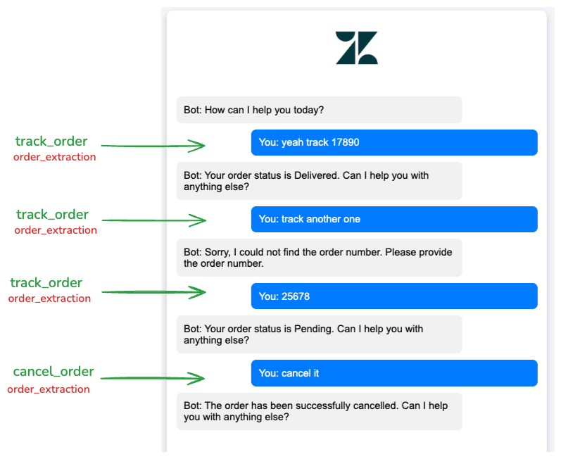
Explanation:
1. track_order- Triggered by user saying 'yeah track 17890'. This also leads to an LLM call for extracting the order_id. (order_extraction)
2. track_order- Triggered by user saying 'track another one'. This also leads to an LLM call for extracting the order_id. (order_extraction)
3. track_order- Triggered by user saying '25678'. This also leads to an LLM call for extracting the order_id. (order_extraction)
4. cancel_order- Triggered by user saying 'cancel it'. This also leads to an LLM call for extracting the order_id. (order_extraction)


## Qualitative performance
### Happy cases qualitative performance

#### Only tracking
- **The user can ask for tracking in multiple ways, so the word 'track' does not need to be mentioned at all.**
- **Multiple orders can be tracked in the same conversation. At each turn, the bot understands which order the user is talking about.**\

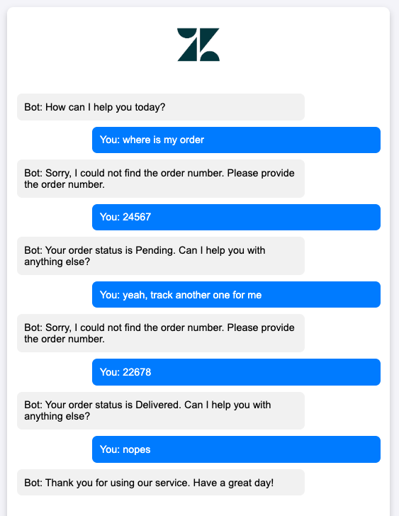

#### Only cancellation
- **The user can ask for cancellation in multiple ways, so the word 'cancel' does not need to be mentioned at all.**
- **Cancellation of order happens in accordance with the policies.**

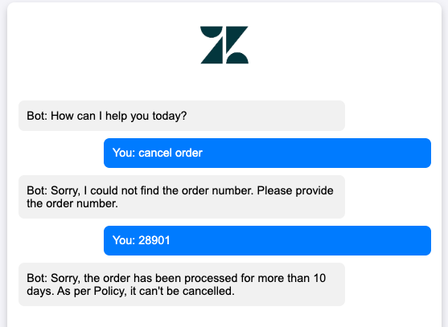
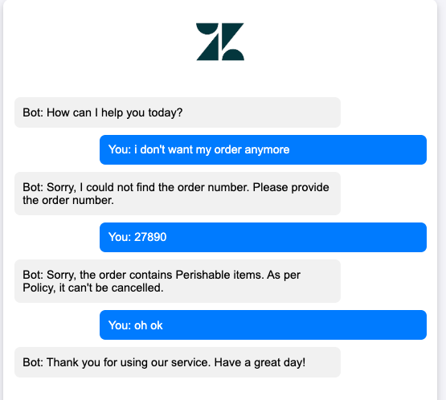

#### Tracking and cancellation in the same conversation
- **Multiple tracking and cancellations can be done in the same conversation. At each step, the bot knows which order the user is talking about.**\
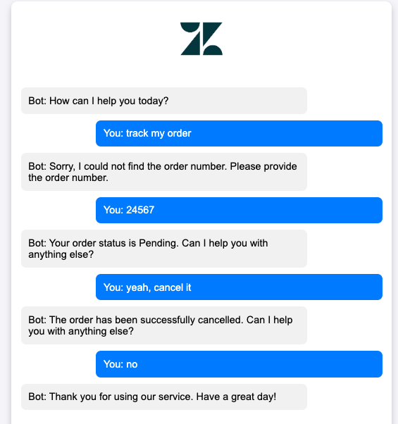
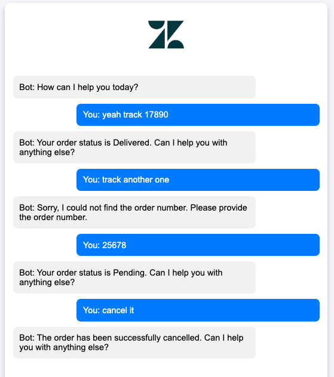

#### Other action qualitative performance
- **The bot can handle other actions well and tries to steer the conversation back to tracking or cancellation.**
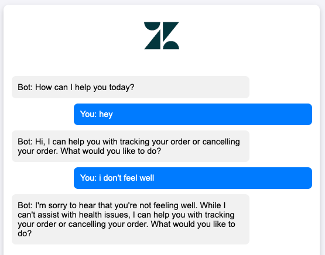

### Failure modes qualitative performance
- **The bot does not handle multiple cancellations in the same statement well.**\
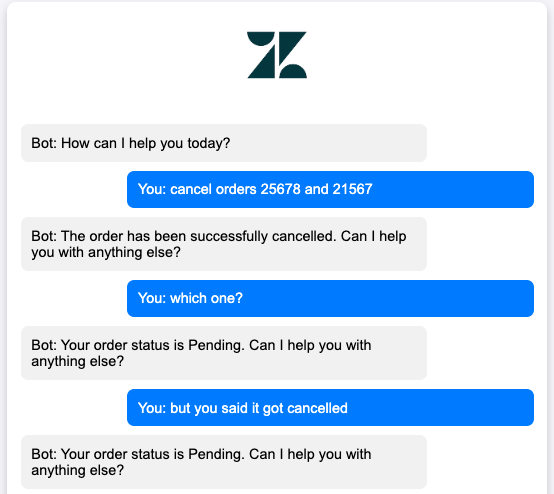
- **The bot has no awareness of the database, so it doesn't know what user's last order was and cannot handle queries like 'show me all my orders'.**\
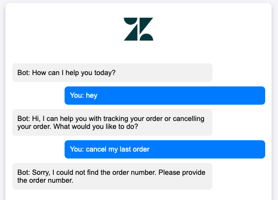
- **In some cases, when the user deviates from tracking or cancellation, but mentions other common ecommerce actions like 'refund' or 'return', the bot attempts to solve these unsupported actions instead of bringing the conversation back to tracking and cancellation.**\
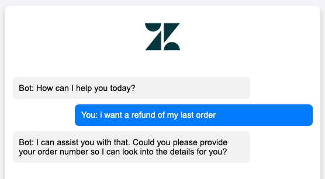
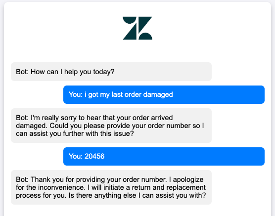

## Quantitative performance
Following metrics have been used to evaluate the quality of bot actions and outcomes:
1. **Next action classification accuracy**: 97% (Described above in steps 4-5 of the Approach section)
2. **Response Appropriateness**: A score of 1 if the bot's response is appropriate, 0 otherwise. 
This measures if the bot has been able to satisfy the user's request. After the conversation ends, or when a predefined maximum number of turns in the conversation is reached, the bot's response is evaluated for appropriateness by calling an LLM. 
The prompt can be examined [here](../components/resources/conv_evaluation_prompt.txt) and the utility can be found [here](../components/evaluation.py). 
Example of Inappropriate Response:
```
Bot: How can I help you today?
User: Cancel orders 27890 and 28901
Bot: Sorry, the order contains Perishable items. As per Policy, it can't be cancelled.
User: which one?
Bot: Your order status is Pending. Can I help you with anything else?
User: which order is pending?
Bot: Your order status is Pending. Can I help you with anything else?
```
Example of Appropriate Response:
```
Bot: How can I help you today?
User: i placed an order on 25.02 and still haven't got it
Bot: Sorry, I could not find the order number. Please provide the order number.
User: i think it's 28901
Bot: Your order status is Pending. Can I help you with anything else?
```
3. **Turn counter**: The number of turns taken to complete the conversation. Lower is better. Intuition: Presence of long turns means that user is not able to get the desired information quickly.

Response Appropriateness and Turn counter are calculated for each conversation and then averaged as can be seen in the Opik dashboard below:
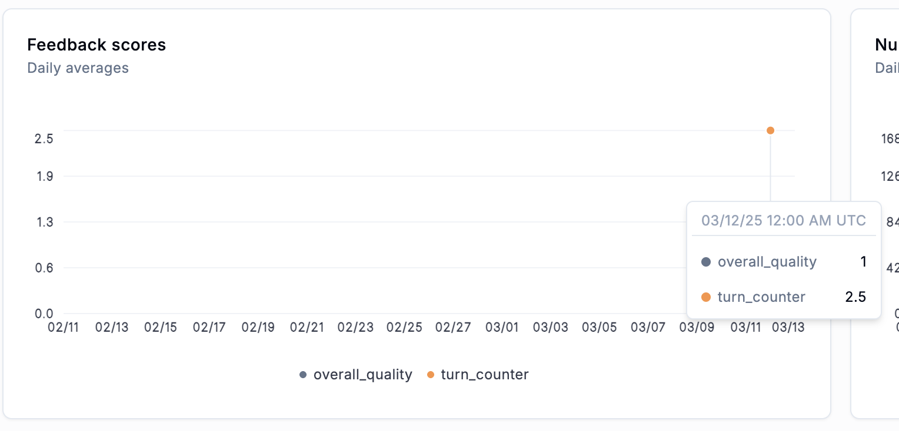
The `overall_quality` in the graph is the Response Appropriateness metric.
The `turn_counter` is the Turn counter metric.
These can be monitored in production to see how the bot is performing. Alarms can also be set up if the quality drops below a certain threshold. In the graph above, the bot has been able to respond appropriately in all the conversations so far and has been able to resolve user request in an average of 2.5 turns across multiple conversations. 
The metric can be seen via Opik, by navigating to the 'Metrics' tab. (Refer Readme in the root directory to learn how to setup and access Opik)

### Token usage, costs and latency
Using Opik, the token usage and latency can be monitored.

#### Token count
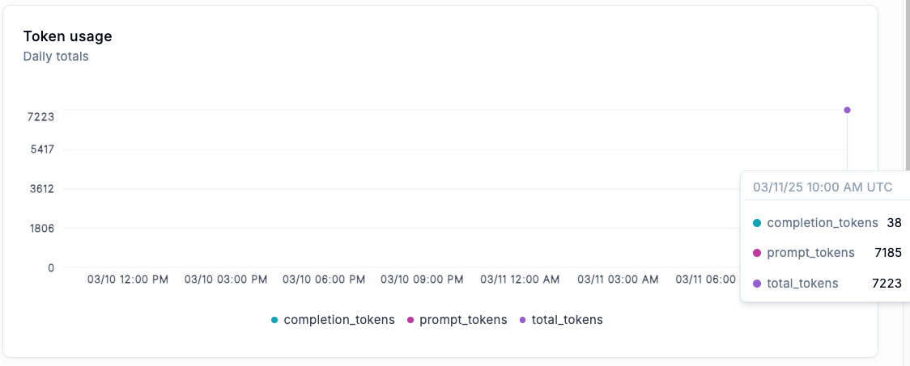

#### Latency
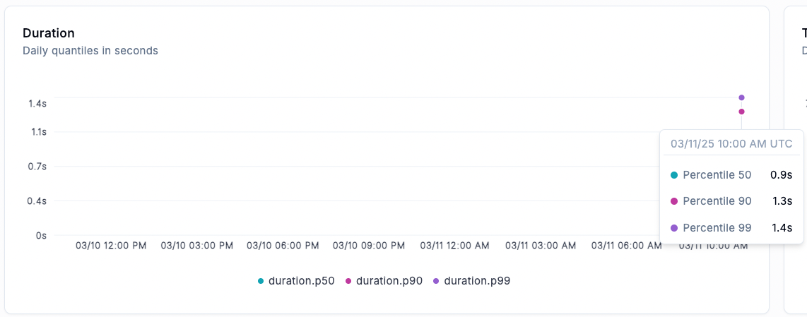

#### Cost tracking
Opik seems to have a bug when displaying AzureOpenAI costs, so had to do it via a script [here](../scripts/costs_get_all_opik_data.py). It gets all the LLM calls data from Opik backend and calculates the costs.

#### Some metrics calculated
- Avg conversation cost: $0.016 (Using Azure Openai pricing from [here](https://azure.microsoft.com/en-us/pricing/details/cognitive-services/openai-service/)).
- Avg tokens per conv: 6515 
- Avg latency per response p50: 0.9 seconds
- Avg calls made to LLM per conversation: 8 (including evaluation calls)

## How to iterate on the bot for better quality responses?
- Always monitor the accuracy on next action classification dataset when next action prompt is updated.
- Run tests [here](../tests) which test the performance of evaluating response appropriateness as well as next action classification.
- Check if after an update to any prompts, whether average response appropriateness has increased or decreased.
- Check if after an update to any prompts, whether average turn counter has increased or decreased.

## Conclusion and future work
### How does the bot perform?
- The bot is able to track and cancel orders effectively and appropriately in most cases.
- The bot is able to steer the conversation back to tracking and cancellation when the user tries to stray away, but fails to do so when other usual ecommerce intents such as refunds are requested.
- Sometimes, a conversation is misclassified as appropriate when the user intent wasn't handled satisfactorily, which indicates a need for better prompt tuning to evaluating response appropriateness.
- Cost of conversation is low and latency seems to be acceptable.

### Next steps
- Choice of LLM- Here GPT-4o was used for all LLM calls. One could use smaller/cheaper/locally hosted models for different actions/evaluation to drive down cost and latency and improve response quality.
- Reduction of LLM calls- Instead of explicit next action classification and order extraction, a setup can be implemented that gets next action and finds the order number in the conversation in the same prompt (possibly using function calling).
- More comprehensive handling of 'Other' action- to reduce hallucinations when bot is asked to 'refund' or engage in other unsupported ecommerce actions.
- Creation of a gold dataset for response appropriateness evaluation- to better tune the prompt for evaluating response appropriateness. (Smilar to what was done for next action classification)
- Addition of more test cases to ensure the bot is able to handle all edge cases and does not regress upon iteration.
- Addition of a 'politeness' metric to evaluate how polite the bot is in its responses.